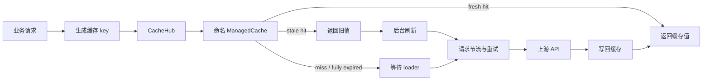
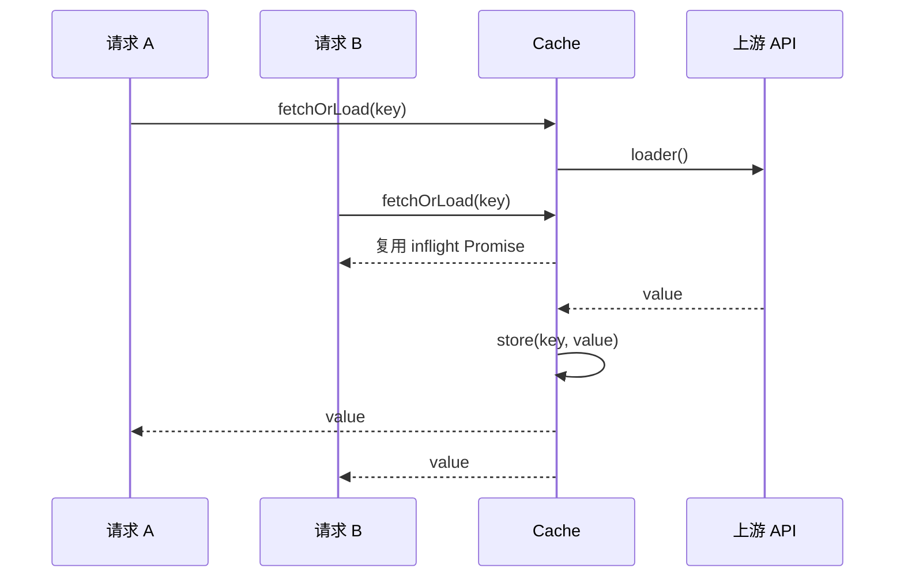

# 缓存模块设计

本文介绍 CNBS MCP Server 当前缓存模块的设计与运行行为，供开发者阅读、维护和扩展。缓存核心实现位于 [`src/services/cache.ts`](../src/services/cache.ts)，业务接入主要位于 [`src/services/api.ts`](../src/services/api.ts) 和 [`src/services/data-sources.ts`](../src/services/data-sources.ts)。

模块采用可插拔后端设计：适配层（`ManagedCache` / `CacheHub`）向业务提供稳定语义，底层存储由 `CacheBackend` 接口抽象。默认后端 `MemoryCacheBackend` 基于成熟的 [`lru-cache`](https://www.npmjs.com/package/lru-cache) 库实现进程内缓存；Redis 等分布式后端作为预留 seam，可在不改动业务代码的前提下按同一接口补充实现。由于后端接口全异步，适配层对外方法（`fetch` / `store` / `getStats` 等）均为异步。

## 1. 设计目标

缓存模块用于减少对国家统计局及外部数据源的重复请求，并在上游响应较慢或短暂失败时改善请求延迟和可用性。

当前设计提供以下能力：

- 进程内 LRU（Least Recently Used）淘汰。
- 按条目设置 TTL。
- 按条目数量和估算数据大小限制缓存。
- 相同 key 的并发加载合并（in-flight deduplication）。
- 在宽限期内返回过期数据并后台刷新（stale-while-revalidate）。
- 命名缓存的统一创建、清空和统计。
- 统一、可复现的缓存键生成。

缓存是性能优化层，不是真实数据源。业务逻辑必须允许缓存丢失，并能够在未命中时重新从上游加载数据。

## 2. 架构概览



模块由四个部分组成：

1. `CacheBackend<V>`：可插拔存储后端接口（全异步），负责键值存取、容量 / 大小淘汰和淘汰事件上报。`MemoryCacheBackend` 是基于 `lru-cache` 的默认实现，`createCacheBackend(kind, options)` 工厂按 `kind`（`memory` / `redis`）创建后端，`redis` 目前抛错预留。
2. `ManagedCache<T>`：适配层，在后端之上实现 TTL、stale-while-revalidate、并发加载合并和统计，是业务直接依赖的对象。
3. `CacheHub`：按名称管理多个适配层实例。
4. `CacheKeyGenerator`：集中生成业务缓存键。

## 3. 存储模型

存储分两层：

- 后端层：`MemoryCacheBackend` 内部持有一个 `lru-cache` 实例，负责最近使用顺序维护、按条目数（`max`）和估算大小（`maxSize` + 每次写入传入的 `size`）淘汰，并在因容量 / 大小压力淘汰时通过 `dispose(reason==='evict')` 回调上报。
- 适配层：`ManagedCache` 把业务值包装成统一的缓存信封（`CacheEnvelope`）后交给后端存取，自身仅额外维护 `inflightMap<string, Promise<T>>`（正在执行的异步加载）与命中 / 未命中 / 过期计数。

缓存信封包含以下字段：

| 字段 | 含义 |
|---|---|
| `value` | 缓存值 |
| `expireAt` | 绝对过期时间戳（fresh 截止） |
| `hitCount` | 当前条目的命中次数 |
| `lastHit` | 最近一次写入或命中的时间 |
| `storedAt` | 写入时间 |
| `size` | 通过 JSON 序列化估算的大小 |

TTL、fresh / stale / expired 判定以信封中的 `expireAt` 为准，与后端无关，使内存与未来 Redis 后端具有一致语义。查找、插入、删除和单条 LRU 淘汰由 `lru-cache` 提供，理想路径为 O(1)。`getStats()` 需要遍历后端全部条目计算 `oldestEntry` / `topHit`，复杂度为 O(n)。

## 4. 配置项

`ManagedCache` 支持以下配置：

| 配置 | 默认值 | 说明 |
|---|---:|---|
| `capacity` | 1000 | 最大条目数（映射为 `lru-cache` 的 `max`） |
| `defaultExpire` | 24 小时 | 未单独指定时使用的 TTL |
| `maxMemorySize` | 100 MiB | 缓存值的估算大小上限（映射为 `lru-cache` 的 `maxSize`） |
| `cleanupInterval` | 60 秒 | 保留字段，淘汰已由底层库接管，当前不再使用 |
| `backend` | `memory` | 存储后端类型，可为 `memory` 或 `redis`（预留） |

后端类型也可通过环境变量 `CNBS_CACHE_BACKEND` 指定；`options.backend` 优先，其次环境变量，默认 `memory`。选择 `redis` 时工厂会抛出 “not implemented” 错误。

## 5. 读取与加载流程

### 5.1 同步读取

`fetch(key)` 用于只读取缓存：

1. 尝试执行按需过期清理。
2. key 不存在时记录一次 miss，并返回 `null`。
3. 条目已过期时删除条目，记录 expiration 和 miss，并返回 `null`。
4. 条目有效时更新命中信息、提升到 LRU 头部并返回值。

`fetchMultiple(keys)` 逐个调用 `fetch()`，返回所有命中的键值。

### 5.2 读取或加载

`fetchOrLoad(key, loader, ttl, staleGrace)` 是业务请求的主要入口：

```text
fresh                 stale grace                    fully expired
|---------------------|------------------------------|------------>
写入时间              expireAt                       expireAt + staleGrace
直接返回缓存           返回旧值并后台刷新              等待 loader
```

其行为如下：

- Fresh：立即返回缓存值，计为 hit，并提升 LRU 顺序。
- Stale：在 `staleGrace` 范围内立即返回旧值，计为 hit；若该 key 没有刷新任务，则启动后台刷新。
- Fully expired：删除旧条目，计为 expiration 和 miss，然后调用 loader。
- Miss：调用 loader，成功后按指定 TTL 写回缓存。

后台刷新失败时仅记录 warning，旧值仍作为本次请求结果返回。普通 miss 的 loader 失败会把错误传递给调用方，不会写入失败结果。

### 5.3 并发请求合并

当多个请求同时加载同一个缺失 key 时，第一个请求创建 Promise 并放入 `inflightMap`，后续请求复用该 Promise。因此同一进程内，同一个 key 在同一时刻通常只会产生一次上游加载。



Promise 在成功或失败后都会从 `inflightMap` 删除。合并只在当前 Node.js 进程内生效，不跨 worker 或服务实例。

## 6. 写入与淘汰

`store(key, value, ttl)` 的处理顺序如下：

1. 使用 `JSON.stringify(value).length` 估算值大小。
2. 若估算总大小将超过 `maxMemorySize`，持续淘汰 LRU 尾部条目。
3. 更新已有 key，或在达到 `capacity` 时淘汰一个尾部条目后插入新值。
4. 设置 `expireAt = Date.now() + ttl`，并把条目放到链表头部。

`storeMultiple()` 逐条调用 `store()`。`remove()`、`removeMultiple()` 和 `flush()` 分别用于删除单条、批量删除和清空单个缓存。

LRU 淘汰和 TTL 过期是不同统计口径：

- 因容量或估算大小限制删除时增加 `evictionCount`。
- 因 TTL 删除时增加 `expirationCount`。
- 主动 `remove()` 和 `flush()` 不增加这两个计数。

## 7. 过期清理

缓存不会创建 `setInterval` 或其他后台定时器。容量和估算大小压力下的淘汰由底层 `lru-cache` 自动完成；TTL 过期在读取时判定：`fetch()` 和 `fetchOrLoad()` 命中已超过 `expireAt`（且超出 stale 宽限）的条目时，删除该条目并累加 `expirationCount`。

这种方式具有以下特点：

- 模块加载和缓存构造不会启动定时任务。
- 空闲时不会产生后台工作。
- 完全空闲、既无读取又无容量压力的过期条目可能继续占用内存，直到下一次访问或被容量 / 大小淘汰。
- 不再有周期性 O(n) 全量清理扫描。

## 8. 缓存中心与生命周期

`CacheHub.getCache(name, options)` 按名称返回缓存实例。同一名称始终返回第一次创建的实例，后续调用传入的新配置不会覆盖已有实例。

全局导出 `cacheHub` 是指向懒加载单例的 `Proxy`。真正的 Hub 在第一次访问时创建，以保持模块加载阶段无缓存初始化副作用。

Hub 提供以下操作：

| 方法 | 说明 |
|---|---|
| `getCache(name, options)` | 获取或创建命名缓存 |
| `removeCache(name)` | 删除一个命名缓存 |
| `flushAll()` | 清空所有缓存内容，保留实例 |
| `getAllStats()` | 返回所有命名缓存的统计信息 |
| `closeAll()` | 调用各缓存的 `close()` 并删除所有实例 |

当前内存后端没有文件句柄、网络连接和 timer，因此 `ManagedCache.close()` 仅释放后端资源（清空淘汰回调），是兼容上层生命周期调用的轻量实现。

## 9. 缓存键设计

缓存键由 `CacheKeyGenerator` 统一生成：

| 数据类型 | 格式 |
|---|---|
| 搜索 | `search_<keyword>_<page>_<pageSize>` |
| 节点 | `node_<category>_<parentId-or-root>` |
| 指标 | `metric_<setId>_<name-or-all>` |
| 序列 | `series\|<setId>\|<metricIds>\|<periods>\|<areas>` |
| 外部数据源 | `datasource_<source>_<sorted-params>` |

序列 key 会排序指标、周期和地区代码，并对各值执行 `encodeURIComponent`，使参数顺序不同但语义相同的请求共享缓存，同时避免分段碰撞。详细规则参见 [`docs/cache-key-design.md`](cache-key-design.md)。

新增缓存调用时应遵循以下原则：

- key 必须包含所有会影响响应内容的输入。
- 无序集合应先归一化排序。
- 分段和值应使用不会产生歧义的分隔方式和编码。
- 不应将访问令牌、Cookie 或其他敏感信息写入 key。

## 10. 当前缓存实例

国家统计局客户端创建三个主要缓存：

| 缓存名 | 容量 | Fresh TTL | Stale grace | 主要内容 |
|---|---:|---:|---:|---|
| `node` | 500 | 24 小时 | 搜索 5 分钟；节点 30 分钟 | 搜索结果、目录节点 |
| `metric` | 1000 | 12 小时 | 15 分钟 | 指标列表 |
| `series` | 2000 | 1 小时 | 10 分钟 | 统计序列数据 |

外部数据源使用独立命名缓存：

| 缓存名 | 容量 | 操作 | Fresh TTL | Stale grace |
|---|---:|---|---:|---:|
| `world_bank` | 2000 | 数据查询 | 24 小时 | 2 小时 |
| `imf` | 1000 | 数据查询 | 24 小时 | 4 小时 |
| `imf` | 1000 | 指标目录 | 7 天 | 12 小时 |
| `oecd` | 1000 | 数据查询 | 24 小时 | 2 小时 |
| `bis` | 800 | 数据查询 | 12 小时 | 1 小时 |
| `census` | 500 | 普查数据查询 | 7 天 | 24 小时 |
| `department` | 800 | 部门数据查询 | 4 小时 | 30 分钟 |

表中的 Fresh TTL 以 `fetchOrLoad()` 调用显式传入的值为准；它可能不同于创建缓存实例时设置的 `defaultExpire`。

## 11. 可观测性

`getStats()` 返回：

| 指标 | 说明 |
|---|---|
| `size` / `capacity` | 当前条目数和容量上限 |
| `memorySize` / `maxMemorySize` | 当前估算大小和配置上限 |
| `oldestEntry` | 按 `lastHit` 计算最久未访问的条目 |
| `topHit` | 当前缓存中命中次数最多的条目 |
| `totalHits` / `totalMisses` | 累计命中和未命中次数 |
| `hitRate` / `missRate` | 基于累计 hit/miss 计算的百分比 |
| `evictionCount` | 因容量或大小压力发生的淘汰数 |
| `expirationCount` | 因 TTL 过期删除的条目数 |
| `persistenceCount` | 兼容字段，当前恒为 0 |

MCP `/health` 资源通过 `cacheHub.getAllStats()` 暴露所有命名缓存的统计快照。

日志使用 `cache` logger：fresh、stale 和 miss 分别记录 `l1`、`l1-stale` 和 `miss` 来源；后台刷新失败记录 warning。

## 12. 开发者使用方式

推荐通过 Hub 获取命名缓存，并使用 `fetchOrLoad()` 封装上游调用：

```ts
const cache = cacheHub.getCache<MyResponse>('example', {
  capacity: 500,
  defaultExpire: 60 * 60 * 1000,
});

const value = await cache.fetchOrLoad(
  cacheKey,
  () => loadFromUpstream(),
  60 * 60 * 1000,
  10 * 60 * 1000,
);
```

开发新接入时应确认：

1. 响应是否允许在 stale grace 内返回旧值。
2. TTL 是否符合上游数据更新频率。
3. key 是否覆盖全部响应参数并完成归一化。
4. loader 是否已有超时、重试和请求节流。
5. 返回值是否可安全按引用共享；调用方不应修改缓存对象。

## 13. 作用域与一致性边界

当前默认（`memory`）后端完全位于 Node.js 进程内：

- 不写磁盘，也不使用 Redis（Redis 后端已在 `CacheBackend` 接口中预留，但尚未实现）。
- 进程退出或重启后缓存全部丢失。
- 多进程、worker 或多个服务实例之间不共享缓存和 in-flight Promise。
- 不提供跨实例主动失效或一致性保证。
- 缓存值按对象引用返回，不进行深拷贝。

若将来接入 Redis 等分布式后端，跨实例共享由后端提供，但 in-flight 合并仍是进程内优化，且反序列化后缓存值不再是同一对象引用。

因此，它适合公开、读多写少、允许短期陈旧的统计数据，不适合作为权限、配额、事务状态或其他强一致数据的存储。

## 14. 当前实现注意事项

以下行为是维护和演进时需要注意的现状：

### 14.1 Stale grace 是尽力而为

`fetchOrLoad()` 的 fresh / stale / expired 判定以信封 `expireAt` 为准，不再有周期性全量清理提前删除宽限期内的条目。但底层 `lru-cache` 仍可能因容量或估算大小压力淘汰处于宽限期的条目，从而使该 key 走普通 miss 路径。

因此，当前 `staleGrace` 仍不能视为严格保证的可用窗口。若后续要求稳定的 SWR 语义，应结合后端能力显式区分 fresh 截止与硬删除时间。

### 14.2 大小限制是估算值

`JSON.stringify(value).length` 既不是对象的实际堆内存，也不是严格的 UTF-8 字节数。循环引用会使估算回退为 0；对象元数据、字符串编码和 V8 开销均未计入。

`maxMemorySize` 只能作为相对压力控制，不能替代进程 RSS/heap 监控和运行环境内存限制。单个条目大于上限时，当前实现会先清空其他条目，随后仍可能插入该超大条目。

### 14.3 内存计数由底层库维护

`memorySize` 现在直接取自 `lru-cache` 的 `calculatedSize`，写入时按 `JSON.stringify(value).length` 传入 `size`（下限 1，并被裁剪到不超过 `maxSize`，以避免单个超大条目触发库的拒绝）。旧实现中链表记账偏移导致计数为负的问题已随手写链表一并移除。

即便如此，`maxMemorySize` 仍只是相对压力控制，不能替代进程 RSS/heap 监控和运行环境内存限制。

### 14.4 Loader 没有缓存层超时

`inflightMap` 会一直持有尚未结束的 loader Promise。当前上游 HTTP 请求自身配置了超时和重试，但缓存 API 不接收 `AbortSignal`，也不提供独立 loader 超时。新增非 HTTP loader 时应自行保证其最终结束。

### 14.5 未实现负缓存

loader 的错误不会缓存。持续查询不存在的资源或持续失败的上游会在每轮请求中重新加载。是否引入短 TTL 负缓存，应按错误类型和业务语义单独决定。

## 15. 测试与修改建议

现有基础测试位于 [`src/__tests__/cache.test.ts`](../src/__tests__/cache.test.ts)，覆盖基本存取、过期、统计、LRU 容量淘汰和 key 生成。

修改缓存核心行为时，建议至少验证：

- 命中后 LRU 顺序和大小统计。
- 更新已有 key 后的容量和大小统计。
- TTL 边界及过期计数。
- stale 返回、后台刷新成功和失败。
- 同 key 并发合并及 Promise 失败后的清理。
- 容量淘汰与估算大小淘汰。
- 超大条目、不可序列化值和 `null` 值。
- Hub 同名实例复用及全量清理。

底层已用成熟的 `lru-cache` 库替换手写实现，`ManagedCache` 和 `CacheHub` 作为项目适配层保留，业务代码继续依赖现有语义而非第三方库 API。新增其他后端（如 Redis）时，只需实现 `CacheBackend` 接口并在 `createCacheBackend` 工厂中注册，无需改动业务调用。
